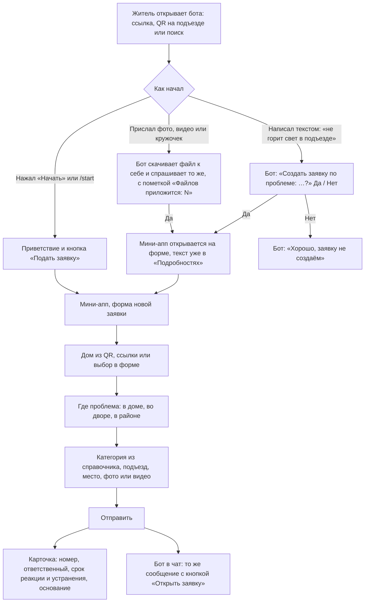
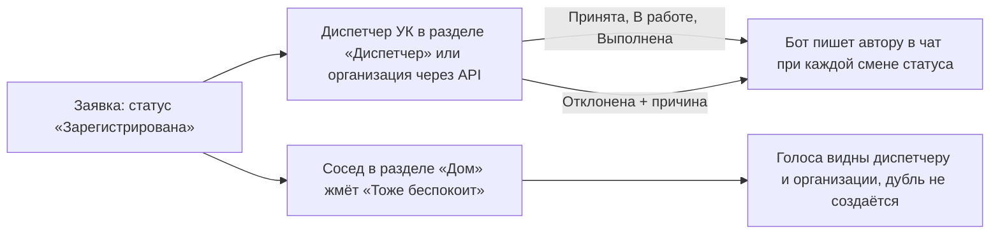

# Путь заявки через бота MAX

Как житель подаёт заявку из чата и что происходит дальше. Диаграммы в Mermaid, GitHub
их рисует сам. Все шаги проходятся в мобильном и веб-MAX, бот `@t6_hakaton_max_bot`.

## Житель

Ответственный и сроки берутся из справочника категорий: у каждой записан владелец
(УК, АДС, РСО, муниципальная служба, участковый), норматив в часах и основание.

## Дальше

## Групповой чат дома

Бот добавляется в домовой чат админом чата. Отвечает только когда позвали: на команды,
упоминание `@t6_hakaton_max_bot` и сообщения со словами «заявка», «авария», «проблема»,
«жалоба». На такое сообщение отвечает тем же вопросом «Создать заявку?», кнопка «Да»
открывает мини-апп у того, кто нажал. Приветствие с кнопкой шлёт при добавлении в чат,
в каналы не пишет.

## Команды

| Команда | Что делает |
| --- | --- |
| `/start` | Приветствие и кнопка «Подать заявку». С параметром `house_<код>` подставляет дом, со `staff_<секрет>` даёт роль админа |
| `/help` | Подсказка и пометка про демо-данные |
| `/id` | ID пользователя в MAX |
| любой текст | Предложение создать заявку с этим текстом |
| фото, видео, кружочек | То же, файл сохраняется у бота и подставляется в форму заявки, до пяти файлов |

## Технически

- События от MAX бот получает long polling. Webhook на `/hook` реализован, но MAX не
  доставлял на него события, подписка снята до выяснения причины.
- Кнопка открытия мини-аппа отправляется по имени бота, MAX открывает привязанное
  мини-приложение с параметром запуска. Текст из чата передаётся в старт-параметре
  как `t_<base64url>`, бот отдаёт его приложению при авторизации.
- Подпись initData проверяется на сервере, демо-ID от 1 до 999 принимаются без подписи для
  проверки в браузере.
